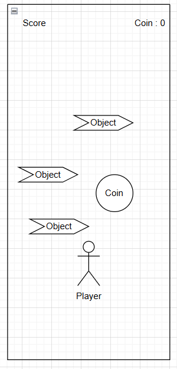

# Crossig_the_street
 길건너기게임 개인 과제
## UML

----
## 와이어 프레임

----
### 구현사항
    - [ ] 키보드 입력처리
        - Input
    - [ ] 오브젝트 생성기능
        - Prefab
    - [ ] 충돌기능
        - Collider
    - [ ] 애니메이션기능
        - Animation, Animator
    - [ ] 점수 UI 시스템
        - UGUI, Coroutine
    - [ ] 사운드 효과
        - 사운드 시스템
    - [ ] 파티클 효과
        - 파티클 시스템
    - [ ] 자동차 데이터 관리
        - ScriptableObject
    - [ ] 오브젝트 생성/삭제 최적화
        - ObjectPool
